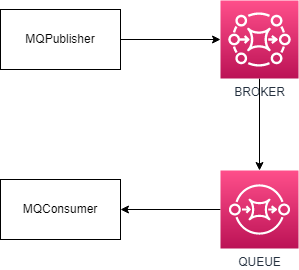

# AMQP adapter

Esse repositório apresenta um formato de adaptador para comunicação através do protocolo AMQP, onde um serviço irá publicar eventos em uma fila (nesse exemplo foi utilizado o RabbitMQ para essa fila) através da classe **MQPublisher**, que implementa esse protocolo de envio por si só, sem ter que utilizar nada além dela.

Para consumir os eventos que foram publicados através do **MQPublisher** é utilizado o **MQConsumer**, uma classe que implementa o protocolo de consumo da fila, assim, facilitando a entrada e saída de eventos em serviços (os quais não vão precisar se importar com o protocolo e a implementação do mesmo).

